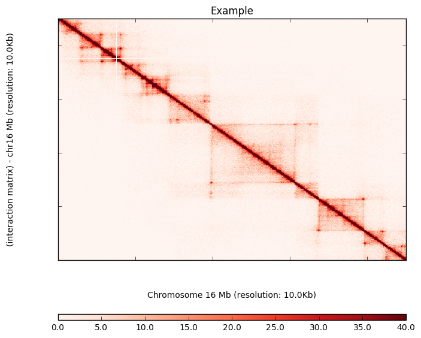

# gpu_ice Package Demo

## Introduction
The elementwise computation of ICE normalization for HiC dataset is highly computationally expensive in particular as super-resolution HiC contact maps are available. To reduce the time of ICE normalization, the massive parallel process power of GPU is leveraged to speedup the process.

The heatmap plotting method is also incoporated to enable visualizing the high resolution contact map on the fly but it is not fully supported. 

## Quick Look

The module uses the Accelerate and Numba modules in Anaconda to programm the GPU. More information about
the dependencies can be found in the Installation section. GTX 1080ti is used for the demo.


```python
import gpu_iced
```

Setup the inline plotting environment for visualizing contact maps


```python
%matplotlib inline
```

The ICE normalization functions are wrapped in the ice_norm object. Initialize an ice_norm object by specifying the path for the matrix file in triplet format. In this demo, an instance of ICE correction for a raw matrix in 10kb resolution has been created.


```python
rep1_ice_norm = gpu_iced.ice_norm("rep1_10000.matrix")
```

Load the matrix and transfer it into the device (GPU) memory. Parameters：
> scale: times the matrix with a scaler, default 1

> coerce: type the value of the matrix as float if it sets False (default). Otherwise, it will type as int

> out_dtype: set the type of the matrix in the GPU device, default np.float32. Set to np.int32 to reduce the GPU memory footprint

> filterlow_percent: filter the low coverage bins, default 0.02. Set to 0 to disable filter

> include_zero: whether counting zero bins in filter percentage, default True

Using default setting to load matrix


```python
rep1_ice_norm.make_matrix()
```

    Matrix properties:
    size: 265503 X 265503
    non-zero elements: 388661243
    sparsity: 0.005513563362932332
    sequence depth: 406869792.0


Matrix properties are returned for reference.

Inspect on the raw matrix before doing ICE normalization


```python
rep1_ice_norm.plotHeatmap_on_the_fly(chromosome='chr16', resolution=10000, names='Example', start=2200, end=2650, 
                            tripleColumn=1, bedFile='rep1_10000_abs.bed', matrixMax = 40, upSide=1,heatmapColor=1)
```


Perform 50 iters of ICE


```python
%time rep1_ice_norm.ice(epoches=50)
```

    @ 50 round iteration, current eps: 383.386
    CPU times: user 11.7 s, sys: 2.63 s, total: 14.4 s
    Wall time: 18.4 s


Inspect the ICE normalization effect.


```python
rep1_ice_norm.plotHeatmap_on_the_fly(chromosome='chr16', resolution=10000, names='Example', start=2200, end=2650, 
                            tripleColumn=1, bedFile='rep1_10000_abs.bed', matrixMax = 40, upSide=1,heatmapColor=1)
```





Save the normalized matrix as triplet table


```python
rep1_ice_norm.write_matrix("rep1_10000_iced.matrix")
```

## Installation

The program relies on the Accelerate and Numba modules in Anaconda to programm the GPU, numpy and scipy for general matrix computation, and pandas and cython for IO. Anaconda provides free academic subscriptions. Besides, a gpu set up with cuda-tools. Find the installation information of Accelerate and Anaconda from the [link](https://docs.continuum.io/accelerate/#installation). Once you have the prerequisition, copy the script folder and import the gpu_iced to run the matrix correction processes. All programs are running under python3.

## Author

Hanbin Lu, hal213@ucsd.edu
