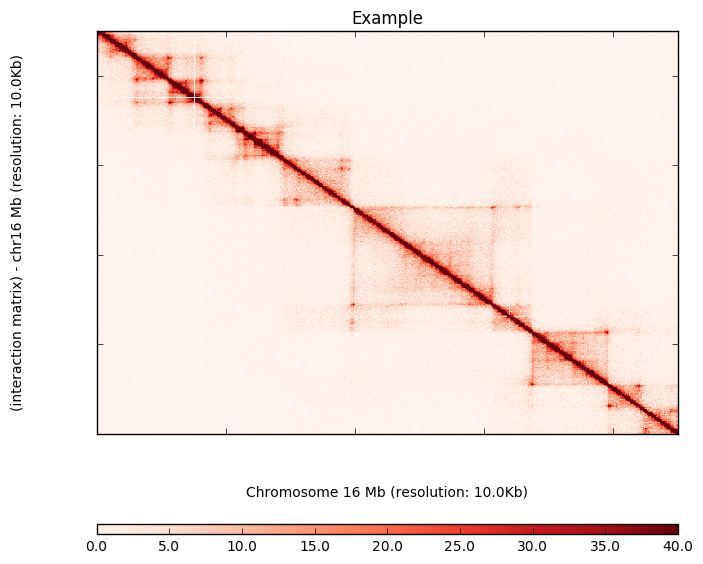

# gpu_ice package demo

## Introduction
Correcting the raw HiC matrix is important for(please edit). However, the time for correcting a high resolution contact matrix can be on the order of hours. So far, the Cython optimized ICE correction, was developed to address lengthy wait times such that the time for correcting a high resolution contact matrix has further been cut down to ~30 min. While, these current methods have improved in processing a raw HiC matrix, it lacks in practicality for realtime, interactive user  Since the graphic card, GPU, is exceptionally proficient with matrix (or elementwise) computation, I am testing how efficient the GPU can boost the correction process speed for viewing a high resolution contact map. Using a commonplace GPU, the correction time can be cut down to less than a minute. Together, embracing the power of the GPU computing engine, manipulating and visualizing a high resolution HiC matrix are performed in realtime.

## Quick Look

The module uses the Accelerate and Numba modules in Anaconda to programm the GPU. More information about
the dependencies can be found in the Installation section.


```python
import gpu_ice
```

Setup the inline plotting environment for visulizing contact maps


```python
%matplotlib inline
```

The ICE normalization functions are wrapped in the ice_norm object. Initialize an ice_norm object by specifying the matrix file in triplet format. In the example, an instance of ICE correction for a raw matrix in 10kb resolution has been created. The raw matrix are built by HiC-Pro pipeline from CH12-LX HiC data from Rao, 2014 cell paper.


```python
rep1_ice_norm = gpu_ice.ice_norm("rep1_10000.matrix")
```

Load the matrix and transfer it into the device (GPU) memory. The device memory usage will be discussed in the documentation session. Also, it will cover the details of runing the program in split mode, analysing by chuncks to reduce device memory usage.


```python
rep1_ice_norm.make_matrix(coerce=True)
```

    Matrix properties:
    size: 265503 X 265503
    non-zero elements: 388661243
    sparsity: 0.005513563362932332
    sequence depth: 406869792.0


Matrix properties are returned for further reference.

Before we do ICE, we can take a quick look of the raw matrix, the starting point. And you can always reset the normalized matrix back to raw...


```python
rep1_ice_norm.plotHeatmap_on_the_fly(chromosome='chr16', resolution=10000, names='Example', start=2200, end=2650, 
                            tripleColumn=1, bedFile='rep1_10000_abs.bed', matrixMax = 40, upSide=1,heatmapColor=1)
```


The raw matrix are corse, especially the dots, interactions, are buried. We will do matrix correction which are performed in GPU and times the process. Let's do 1 round ICE to get the baseline of the speed. 


```python
%time rep1_ice_norm.ice(epoches=1)
```

    @ 1 round iteration, current eps: 124565.0
    CPU times: user 592 ms, sys: 200 ms, total: 792 ms
    Wall time: 5.05 s


```python
rep1_ice_norm.plotHeatmap_on_the_fly(chromosome='chr16', resolution=10000, names='Example', start=2200, end=2650, 
                            tripleColumn=1, bedFile='rep1_10000_abs.bed', matrixMax = 40, upSide=1,heatmapColor=1)
```





One round of ICE takes roughly 1 second on a 265503X265503 sparse matrix with 388661243 elements. I am also curious how 1 iteraction can do to the raw matrix. Plot the same region to compare.

The noise of the matrix is reduced hugely. But the features are still blurry. We will do 20 more iteration to see what will happen. Same, we will time the process to show the performance of the GPU.


```python
%time rep1_ice_norm.ice(epoches=50)
```

    !!!!!!!!!!!!!!!!!!!!!!!!!!!!!!!!!!!!!!!!
    Matrix had been ICE normalized before. Further ICE will perform on
    the existed normalized matrix. To start from raw matrix, call the
    make_matrix method with reset=1
    !!!!!!!!!!!!!!!!!!!!!!!!!!!!!!!!!!!!!!!!
    @ 1 round iteration, current eps: 83602.7
    @ 50 round iteration, current eps: 41.0863
    CPU times: user 10.4 s, sys: 2.48 s, total: 12.9 s
    Wall time: 12.9 s


You need to wait 14 seconds for 20 more rounds ICE. Get yourself ready for the high resolution contact map in that 14 seconds.


```python
rep1_ice_norm.plotHeatmap_on_the_fly(chromosome='chr16', resolution=10000, names='Example', start=2200, end=2650, 
                            tripleColumn=1, bedFile='rep1_10000_abs.bed', matrixMax = 40, upSide=1,heatmapColor=1)
```


Let the figure talk itself.

## Installation

The programs relies on the Accelerate and Numba modules in Anaconda to programm the GPU. Anaconda provides free academic subscriptions. Find the installation information of Accelerate and Anaconda from the [link](https://docs.continuum.io/accelerate/#installation). Once you have the prerequisition, copy the script folder and import the gpu_ice to run the matrix correction processes. All programs are running under python3.

## Author

Hanbin Lu, hal213@ucsd.edu
